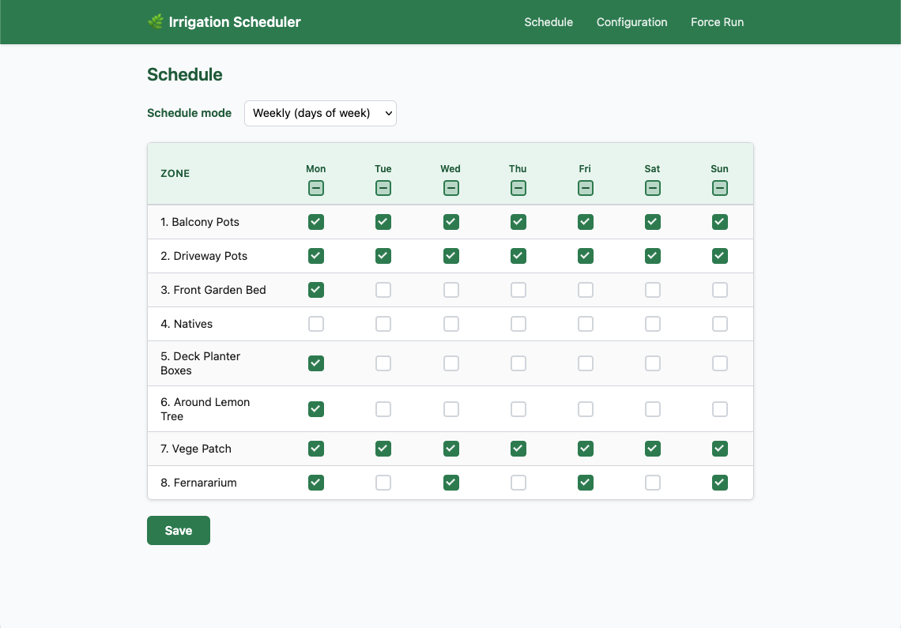
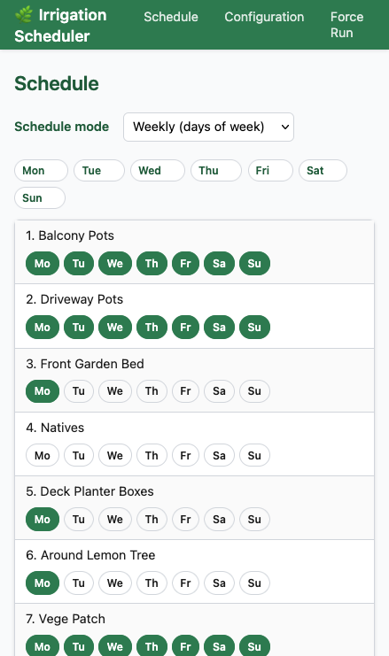
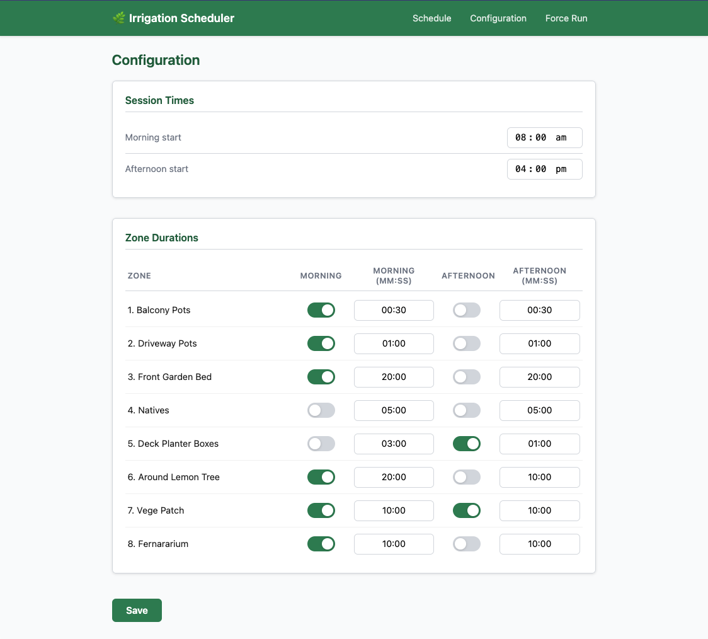
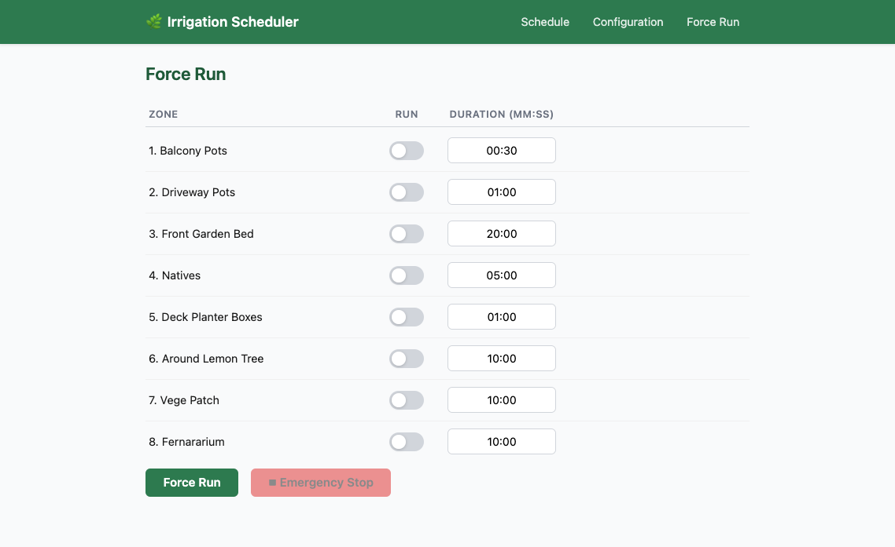

# iu-configurator

## Summary

A web UI for configuring [Home Assistant](https://www.home-assistant.io/)'s [`irrigation_unlimited`](https://github.com/rgc99/irrigation_unlimited) integration.

Generates the YAML config and reloads HA automatically — no manual file editing required (after the first setup of course!).

As well as managing complex schedules, it can also do "fire and forget" sequences that run immediately.

It is fully responsive so you can use it on your phone on the go, or on your desktop or tablet.

I use it to manage my own home watering system so I think I've ironed out any major bugs.

## Screenshots

|                                           Schedule                                           |                                             Schedule (mobile)                                             |                                         Configuration                                         |                                            Force Run                                            |
| :------------------------------------------------------------------------------------------: | :-------------------------------------------------------------------------------------------------------: | :-------------------------------------------------------------------------------------------: | :---------------------------------------------------------------------------------------------: |
| [](docs/schedule-page.png) | [](docs/schedule-mobile.png) | [](docs/config-page.png) | [](docs/force-run-page.png) |

## How it works

1. **Hardware description** — you describe your physical setup once in `iuc-config.yaml` (controllers, zones, entity IDs). This file lives in `CONFIG_DIR` and is read on startup. This is basically a subset of the [Irrigation Unlimited](https://github.com/rgc99/irrigation_unlimited) config.
2. **Schedule editing** — use the web UI to set watering days, durations, and enable/disable per zone.
3. **YAML generation** — whenever you save the schedule the app generates `irrigation_unlimited.yaml` in `CONFIG_DIR` and sends a reload request to Home Assistant so the new config is picked up immediately.

## Usage

The easiest way to use it would be via Docker.

An multi arch image is published to `public.ecr.aws/j0s7z4j0/hopyard/iu-configurator` (see https://github.com/NoxHarmonium/iu-configurator/releases) for the latest version.

### Docker

If you're Home Assistant in a basic Docker setup, you should be able to do something like this:

```shell
$ docker run -p 3000:3000 \
  -e HA_URL=http://homeassistant.local:8123 \
  -e HA_TOKEN=your_token_here \
  -v /your_ha_config_dir:/config \
  public.ecr.aws/j0s7z4j0/hopyard/iu-configurator:latest
```

### Kubernetes

If you're deploying to Kubernetes you probably want something like this:

```yaml
---
apiVersion: apps/v1
kind: Deployment
metadata:
  labels:
    app.kubernetes.io/instance: iu-configurator
  name: iu-configurator
  namespace: some-namespace
spec:
  replicas: 1
  selector:
    matchLabels:
      app.kubernetes.io/instance: iu-configurator
  strategy:
    type: Recreate
  template:
    metadata:
      labels:
        app.kubernetes.io/instance: iu-configurator
    spec:
      containers:
        - envFrom:
            - configMapRef:
                name: iu-configurator
          image: public.ecr.aws/j0s7z4j0/hopyard/iu-configurator:latest
          imagePullPolicy: Always
          livenessProbe:
            failureThreshold: 3
            httpGet:
              path: /healthz
              port: 3000
              scheme: HTTP
            periodSeconds: 10
            successThreshold: 1
            timeoutSeconds: 3
          name: iu-configurator
          ports:
            - containerPort: 3000
              name: http
              protocol: TCP
          readinessProbe:
            failureThreshold: 3
            httpGet:
              path: /healthz
              port: 3000
              scheme: HTTP
            periodSeconds: 10
            successThreshold: 1
            timeoutSeconds: 3
          volumeMounts:
            - mountPath: /ha-config
              name: ha-config
      volumes:
        - name: ha-config
          persistentVolumeClaim:
            # Same PVC as your home assistant deployment so it can write the config file
            claimName: home-assistant-config
---
apiVersion: v1
kind: ConfigMap
data:
  CONFIG_DIR: /ha-config
  HA_TOKEN: SOME_TOKEN
  HA_URL: http://home-assistant.some-namespace.svc.cluster.local:8123
  LEPTOS_ENV: prod
metadata:
  labels:
    app.kubernetes.io/instance: iu-configurator
  name: iu-configurator
  namespace: some-namespace
---
apiVersion: v1
kind: Service
metadata:
  labels:
    app.kubernetes.io/instance: iu-configurator
  name: iu-configurator
  namespace: some-namespace
spec:
  ports:
    - name: http
      port: 3000
      protocol: TCP
      targetPort: http
  selector:
    app.kubernetes.io/instance: iu-configurator
  type: ClusterIP
```

### Configuration

All configuration is via environment variables:

| Variable           | Default        | Required | Description                                                                                              |
| ------------------ | -------------- | -------- | -------------------------------------------------------------------------------------------------------- |
| `CONFIG_DIR`       | `/config`      | No       | Directory where `iu-schedule.json` and the generated `irrigation_unlimited.yaml` are written             |
| `HA_URL`           | _(unset)_      | No       | Home Assistant base URL, e.g. `http://homeassistant.local:8123`. If unset, the HA reload call is skipped |
| `HA_TOKEN`         | _(unset)_      | No       | Long-lived HA access token. Generate one in HA under **Profile → Long-Lived Access Tokens**              |
| `LEPTOS_SITE_ADDR` | `0.0.0.0:3000` | No       | Address the server binds to                                                                              |

## `iuc-config.yaml` Reference

This file describes your physical irrigation hardware. It is **not** managed by the UI — edit it once when you set up the system.

### Top-level fields

| Field              | Type    | Description                                                                     |
| ------------------ | ------- | ------------------------------------------------------------------------------- |
| `poll_interval_ms` | integer | How often (ms) the app polls the HA state to update the run-indicator in the UI |

### `controllers[]`

One entry per irrigation controller (typically one per `irrigation_unlimited` controller entity).

| Field              | Type    | Description                                                                           |
| ------------------ | ------- | ------------------------------------------------------------------------------------- |
| `id`               | string  | Stable identifier (snake_case). Used as the base for generated sequence IDs           |
| `name`             | string  | Human-readable name shown in the generated YAML                                       |
| `preamble_secs`    | integer | Seconds added before the first zone in every sequence (master-valve open delay)       |
| `postamble_secs`   | integer | Seconds added after the last zone in every sequence (drain / master-valve close time) |
| `delay_secs`       | integer | Inter-zone delay inserted between consecutive zones within a sequence                 |
| `ha_master_entity` | string  | HA entity ID of the master valve / binary sensor for this controller                  |

### `zones[]`

One entry per physical zone.

| Field           | Type             | Description                                                                                                                                                                                                                                                                                                                         |
| --------------- | ---------------- | ----------------------------------------------------------------------------------------------------------------------------------------------------------------------------------------------------------------------------------------------------------------------------------------------------------------------------------- |
| `id`            | string           | Stable identifier (snake_case). Must match the key used in `iu-schedule.json`                                                                                                                                                                                                                                                       |
| `controller_id` | string           | Must match the `id` of a controller in `controllers[]`                                                                                                                                                                                                                                                                              |
| `name`          | string           | Human-readable zone name shown in the UI and generated YAML                                                                                                                                                                                                                                                                         |
| `entity_id`     | string           | HA switch entity that opens/closes this zone's valve                                                                                                                                                                                                                                                                                |
| `zone_group`    | string, optional | Concurrency group. Sequences whose zones all belong to the **same** group are allowed to start at the same time (useful for separate controllers that share water pressure independently). Zones with no `zone_group`, or whose zones span multiple groups, are serialised — each sequence starts after the previous one completes. |

### `defaults`

Default values used to seed a blank schedule when no `iu-schedule.json` exists.

| Field                    | Type    | Description                                            |
| ------------------------ | ------- | ------------------------------------------------------ |
| `morning_time`           | string  | Default morning start time, e.g. `"06:00"`             |
| `afternoon_time`         | string  | Default afternoon start time, e.g. `"16:00"`           |
| `zone_morning_secs`      | integer | Default morning watering duration per zone (seconds)   |
| `zone_afternoon_secs`    | integer | Default afternoon watering duration per zone (seconds) |
| `zone_morning_enabled`   | boolean | Whether morning sessions are enabled by default        |
| `zone_afternoon_enabled` | boolean | Whether afternoon sessions are enabled by default      |

### Annotated example

```yaml
poll_interval_ms: 5000

controllers:
  - id: main
    name: Main Garden
    preamble_secs: 5 # 5 s for master valve to open before first zone
    postamble_secs: 5 # 5 s to drain after last zone closes
    delay_secs: 3 # 3 s gap between consecutive zones
    ha_master_entity: binary_sensor.irrigation_unlimited_c1_m

zones:
  # Drip zones that share water pressure — can run at the same time as each other
  - id: pots_front
    controller_id: main
    name: Front Pots
    entity_id: switch.irrigation_zone_pots_front
    zone_group: drip # <-- same group name means concurrent start is allowed

  - id: pots_back
    controller_id: main
    name: Back Pots
    entity_id: switch.irrigation_zone_pots_back
    zone_group: drip

  # Lawn sprinklers — no zone_group, so they are serialised after drip zones finish
  - id: lawn_front
    controller_id: main
    name: Front Lawn
    entity_id: switch.irrigation_zone_lawn_front

  - id: lawn_back
    controller_id: main
    name: Back Lawn
    entity_id: switch.irrigation_zone_lawn_back

defaults:
  morning_time: "06:00"
  afternoon_time: "16:00"
  zone_morning_secs: 600 # 10 min
  zone_afternoon_secs: 300 # 5 min
  zone_morning_enabled: true
  zone_afternoon_enabled: false
```

In this example, if `pots_front` waters Mon/Wed/Fri and `pots_back` waters Tue/Thu, they form two sequences that both start at the configured morning time. The two lawn sequences start only after all drip sequences finish.

## Development

This section is only relevant if you want to work on this codebase:

### Prerequisites

Built with [Leptos](https://github.com/leptos-rs/leptos) + [Axum](https://github.com/tokio-rs/axum).

- Rust stable + `wasm32-unknown-unknown` target
- [`cargo-leptos`](https://github.com/akesson/cargo-leptos)
- [Dart Sass](https://sass-lang.com/install/) (`sass` on PATH)

```bash
rustup target add wasm32-unknown-unknown
cargo install cargo-leptos --version 0.3.5 --locked
```

### Code Organization

It is a bit rough as I wanted to get something working ASAP and I plan to iterate on it later
to clean it up a bit.

The Rust code is organised by responsibility to keep concerns separated:

- `src/handlers.rs`: API endpoints (currently just health checks).
- `src/models/`: domain/application models.
- `src/pages/`: Leptos pages (the UI/frontend)
- `src/repositories/`: persistence and file I/O boundaries.
- `src/server_fns.rs`: Leptos server-function boundary (request extraction, orchestration, response mapping).
- `src/services/`: domain/application services and external integrations.
- `src/utils/`: shared cross-layer helpers.

When adding new logic:

- Put HTTP boundary and transport mapping in `server_fns.rs`.
- Put storage/file concerns in `repositories/`.
- Put business workflows and external API clients in `services/`.
- Put generic reusable helpers in `utils/`.

### Test & Lint

```bash
cargo test --features ssr
cargo clippy --features ssr -- -D warnings
cargo clippy --features hydrate --target wasm32-unknown-unknown -- -D warnings
cargo fmt --check
```

### Production Build

```bash
cargo leptos build --release
```

Produces:

- `target/release/iu-configurator` — the server binary
- `target/site/` — static assets (JS, WASM, CSS)

---

### Docker

#### Docker Compose Stack

Bring up an isolated stack with Home Assistant for integration testing.

Hot reload is supported by the Docker Compose `--watch` switch.

```
docker compose up --watch --build
```

The config directory is already mounted in, so it should work out of the box.
Irrigation Unlimited is installed already, and there are some dummy irrigation entities hooked up.
You'll just have to do the HA setup wizard each time the stack is spun up from scratch.

#### Single Image

Build and run locally:

```bash
docker build -t iu-configurator .

docker run -p 3000:3000 \
  -e HA_URL=http://homeassistant.local:8123 \
  -e HA_TOKEN=your_token_here \
  -v ./dev/config:/config \
  iu-configurator
```

The `dev/config` volume is where `iu-schedule.json` and `irrigation_unlimited.yaml` are written. Mount it to your actual HA config directory so the generated YAML is picked up directly.

---

## Release

Tagging a `v*.*.*` version triggers the CD workflow to build a multi-arch image (`amd64` + `arm64`) and push it to ECR:

```bash
git tag v1.0.0
git push --tags
```

### CD Workflow

The CD workflow runs three jobs:

1. **`build (amd64)`** — builds the `linux/amd64` image natively on an `ubuntu-latest` runner and pushes it to ECR by digest.
2. **`build (arm64)`** — builds the `linux/arm64` image natively on an `ubuntu-24.04-arm` runner and pushes it to ECR by digest.
3. **`merge`** — combines the two per-arch digests into a single multi-arch manifest list (`linux/amd64` + `linux/arm64`) and applies the semver tags.

Each architecture is built on its own native runner (no QEMU emulation), which dramatically reduces build time. GitHub Actions cache is used for each architecture independently (`scope=amd64` / `scope=arm64`) so Docker layers are reused between runs.

### End-to-End Testing

Cargo-leptos uses Playwright as the end-to-end test tool.
Tests are located in end2end/tests directory.

## Executing a Server on a Remote Machine Without Docker

After running a `cargo leptos build --release` the minimum files needed are:

1. The server binary located in `target/server/release`
2. The `site` directory and all files within located in `target/site`

Copy these files to your remote server. The directory structure should be:

```text
iu-configurator
site/
```

Set the following environment variables (updating for your project as needed):

```sh
export LEPTOS_OUTPUT_NAME="iu-configurator"
export LEPTOS_SITE_ROOT="site"
export LEPTOS_SITE_PKG_DIR="pkg"
export LEPTOS_SITE_ADDR="127.0.0.1:3000"
export LEPTOS_RELOAD_PORT="3001"
```

Finally, run the server binary.
